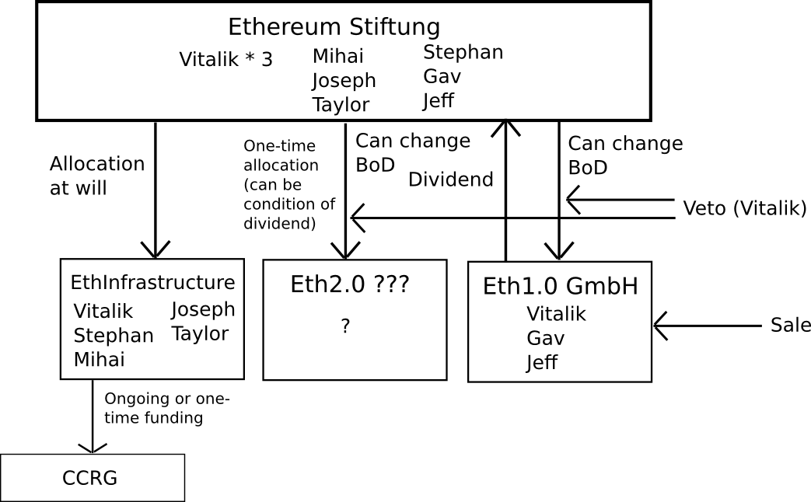
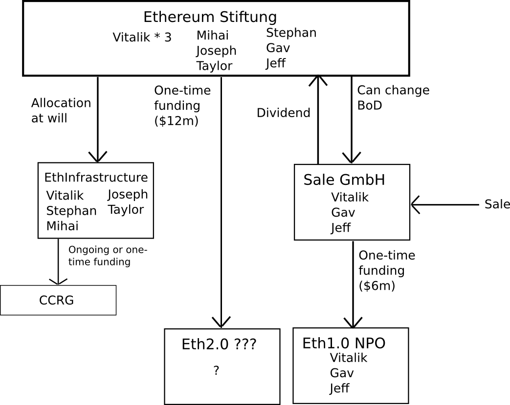

This chapter contains **all the diagrams Vitalik created, adapted or used** until 26 Feb 2015 for various blog posts, presentations and forum posts **since ethereum's inception**. 

This is how the idea for having this chapter included started:

[[[[[[vid here]]]]]]

___

---

---

---

---

---

---

---

---

---

---

---

---

---

---

--- 

---

--- 

---

---

---

---

---

---

---

---

---

---

---

---

---

---

---

---

---

---

---

---

---

---

---

---

---

---

---

---

---

---

---

---

---

---

---

---

---

---

---

---

---

---

---

---

---

---

---

---

---

---

---

---

---

---

---

---

---

---

---

---

---

---

---

---

---

---

---

---

---

---

---

---

---

---

---

---

---

---

---

---

---

---

---

---

---

---

---

---

---

---

---

---

---

---

---

---

---

---

---

---

---

---

---

---

---

---

---

---

---

---

---

---

---

---

---

---

---

---

---

---

---

---

---

---

